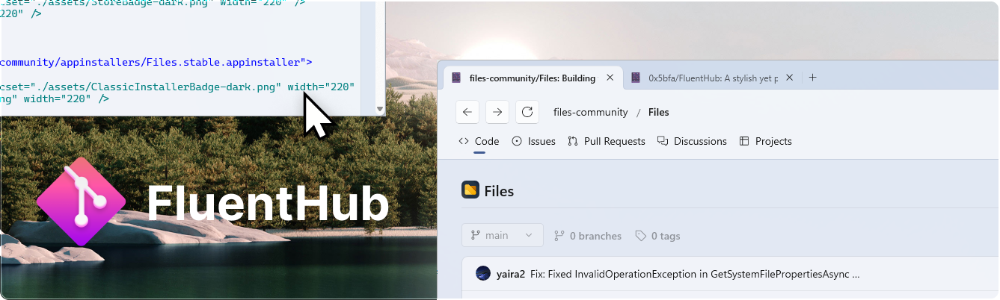
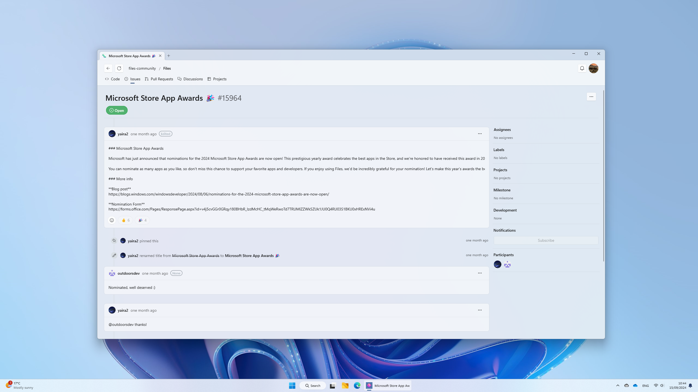
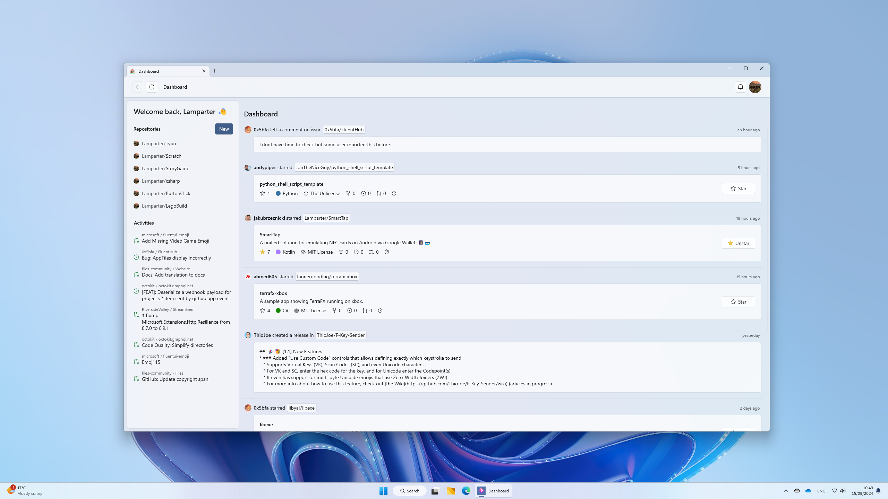
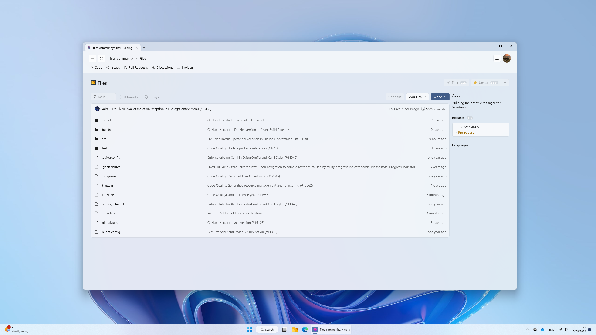
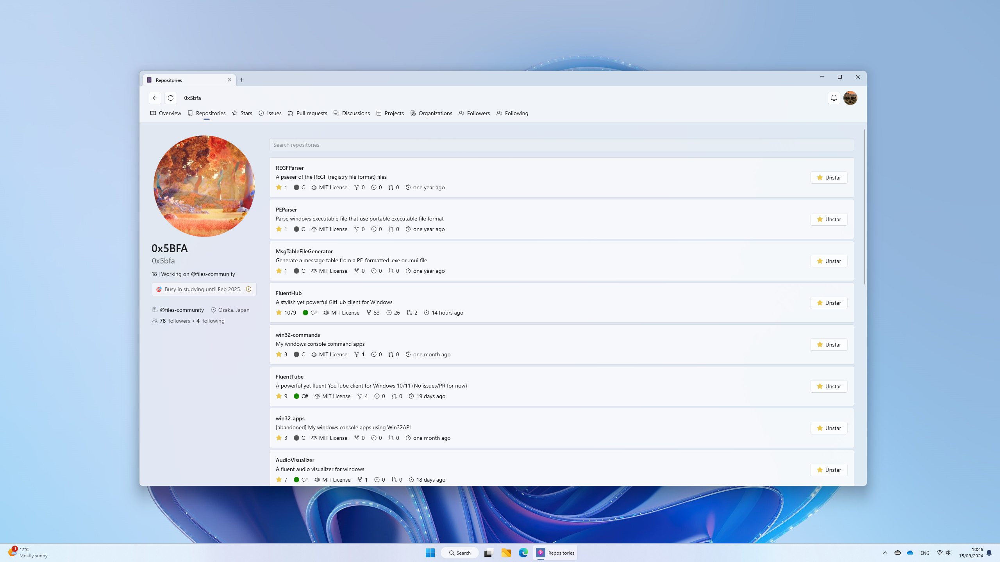

<p align="center">
  
</p>

<p align="center">
  <a style="text-decoration:none" href="https://github.com/0x5bfa/FluentHub/actions/workflows/ci.yml">
    </a>
  <a style="text-decoration:none" href="https://crowdin.com/project/fluenthub">
    </a>
  <a style="text-decoration:none" href="https://dsc.gg/fluenthub">
    </a>
</p>
<p align="center">
  <a style="text-decoration:none" href="https://apps.microsoft.com/store/detail/fluenthub/9nkb9hx8rjz3">
    <picture>
      <source media="(prefers-color-scheme: light)" srcset="https://get.microsoft.com/images/en-us%20dark.svg" width="200" />
      
    </picture></a>
</p>

**A stylish yet powerful GitHub client for Windows**, which empowers development experience and follows the Microsoft Design Language.

- **FluentHub UI:** designed with FluentUI and built on WinAppSdk/WinUI3
- **Multitasking:** with FluentHub you can multi-task with ease with tab support built-in to the app
- **Powerful page navigation:** easily navigate through pages without losing history or progress
- **Just like GitHub:** perform all of your everyday tasks on GitHub such as creating issues and pull requests with built-in API mutation

## Contributing to FluentHub

We welcome community contributions. You can [file an issue](https://github.com/FluentHub/FluentHub/issues/new/choos), propose [your changes](https://github.com/FluentHub/FluentHub/pulls), join [our Discord channel](https://dsc.gg/fluenthub) to connect with us. We especially appreciate help with translating the app [on Crowdin](https://crowdin.com/project/fluenthub)—your contributions make a big difference in reaching a wider audience!

Looking for a place to start? Check out [the task board](https://github.com/users/0x5bfa/projects/7/views/2), where you can sort tasks by size and priority.

## Screenshots



Your dashboard|Your repos|User profile page
---|---|---
||

## Building from source

### 1. Prerequisites

- Windows 10 (Build 10.0.19041.0) or newer with Developer Mode enabled in the Windows Settings
- [Visual Studio 2022](https://visualstudio.microsoft.com/vs/) with [Windows App SDK (version 10.0.22621.0)](https://developer.microsoft.com/en-us/windows/downloads/windows-sdk/) and .NET 8 SDK (.NET Desktop Development workload)

```
git clone https://github.com/FluentHub/FluentHub
```

### 2. Prepare credentials

See [the documentation](../docs/credentials.md).

> [!WARNING]  
> If you skip this step, Visual Studio will fail to build reporting that the `AppCredentials.config` file does not exist.

### 3. Build the project

- Open `FluentHub.sln`.
- Hit 'Set as Startup item' on `FluentHub.Package` in the Solution Explorer.
- Build with `Debug`, `x64`, `FluentHub.Package`.

## Credit

- Many thanks to [Joseph Beattie](https://github.com/josephbeattie) for creating our current logo.
- Join [Developer Sanctuary](https://dsc.gg/devsanx) to learn more about our project!
