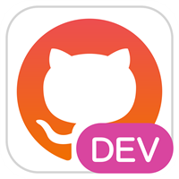

  
  <h1 align="center">FluentHub</h1>

## What is FluentHub?

FluentHub is a GitHub client app with a fluent and powerful design.

Please contribute to make this project better(please follow [this coding guidlines](docs/code-style.md)).

> **Warning**  This project is in dev stage. Expect regular breaking changes. 
> We don't have logos(stable/dev) [that can be used in the store version](https://github.com/logos). Logos/mockups are especially welcome😊

## Building from source

If you want to build this project, you need to take a look at [this instructions](docs/building-from-source.md).

## Privacy

We may use the App Center to track the settings used, find bugs and fix crashes. The information sent to the App Center is anonymous and does not contain any user or contextual data.

## Our goals

* Multi-tab support
  * Go back and forward on the page
  * Jump to the page with the URL of GitHub
  * Copy URL of the page
* App settings
  * App themes
  * App languages
  * Default new page
  * Multi-account support
* Octokit.NET full support
* Support for displaying rendered markdown using WebView

## Translations

This app can be localized. 
Before updating resources, follow [this instructions](docs/translations.md).
