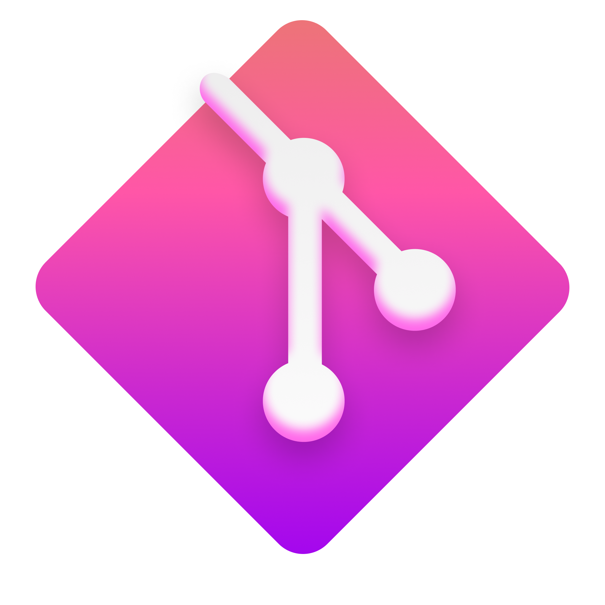

<p align="center">
  
</p>
<h1 align="center">
  FluentHub
</h1>
<p align="center">
  A stylish yet powerful GitHub client.
</p>

<p align="center">
  <a title="Azure Pipeline" target="_blank" href="https://dev.azure.com/fluenthub/FluentHub">
    
  </a>
  <a title="Crowdin" target="_blank" href="https://crowdin.com/project/fluenthub">
    
  </a>
  <a title="GitHub Releases" target="_blank" href="https://github.com/fluenthub-community/FluentHub/releases">
    
  </a>
  <a title="Discord" target="_blank" href="https://discord.gg/8KtRkjq2Q4">
    
  </a>
  <a title="Platform" target="_blank">
    
  </a>
</p>

---
## 🎁 Installation

### Via Microsoft Store

This is the preferred installation method. It allows you to always be on the latest version when we release new builds via automatic updates.

<a title="Microsoft Store" target="_blank" href="https://apps.microsoft.com/store/detail/fluenthub/9nkb9hx8rjz3">
  
</a>

### Via GitHub

Released builds can be manually downloaded from this [repository's releases page](https://github.com/FluentHub/FluentHub/releases).

Download the `FluentHub_<versionNumber>.msixbundle` file from the `Assets` section. In order to install the app, you can simply double-click on the .msixbundle file, and the app installer should automatically run. If that fails for any reason, you can try the following command with a PowerShell prompt:

```powershell
# NOTE: If you are using PowerShell 7+, please run
#   Import-Module Appx -UseWindowsPowerShell
# before using Add-AppxPackage.

Add-AppxPackage FluentHub_<versionNumber>.msixbundle
```

### Building from source

See the [build section](#-building-the-code).

## 📸 Screenshots

*May not always be up-to-date due to constant changes to the user interface*


## 🧑‍💻 Contributing

There are multiple ways to participate in the community:

- [Submit bugs and feature requests](https://github.com/FluentHub/FluentHub/issues/new/choose).
- Review [the documentation](docs/code-style.md) and make pull requests for anything from typos to additional and new idea
- Review source code changes

If you are interested in fixing issues and contributing directly to the code base, please refer to the [documentation](docs/), which covers the following:

- [How to build and run from source](docs/)
- The development workflow, including debugging and running tests
- Coding guidelines
- [Submitting pull requests](https://github.com/FluentHub/FluentHub/pulls)
- [Finding an issue to work on](https://github.com/FluentHub/FluentHub/issues/)
- [Contributing to translations on Crowdin](https://crowdin.com/project/fluenthub)

### 🏗️ Codebase Structure

```
.
├──lib                               // Library for submodules.
|  └──octokit.graphql.net            // Official library for GitHub GraphQL API.
└──src                               // The source code.
   ├──FluentHub.App                  // Code for most front-end elements of the app.
   ├──FluentHub.Core                 // Core elements of the app.
   ├──FluentHub.Octokit              // Code for most back-end and API-related elements of the app such as mutations and queries.
   └──FluentHub.Octokit.Generation   // GitHub GraphQL API model generator.
```

### 🗃️ Contributors

<a href="https://github.com/FluentHub/FluentHub/graphs/contributors">
  
</a>

## 🦜 Feedback

- [Request a new feature](https://github.com/FluentHub/FluentHub/pulls)
- Upvote popular feature requests
- [File an issue](https://github.com/FluentHub/FluentHub/issues/new/choose)
- Join [our Discord](https://discord.gg/8KtRkjq2Q4) and let us know what you think

## 🔨 Building the Code

### 1. Prerequisites

Ensure you have installed the following tools:

- Windows 10 2004 (10.0.19041.0) or later with Developer Mode on in the Windows Settings
- [Git](https://git-scm.com/)
- [Visual Studio 2022](https://visualstudio.microsoft.com/vs/) with following individual components:
  - the Windows 11 (10.0.22000.0) SDK
  - UWP Development Kit
  - [.NET SDK](https://dotnet.microsoft.com/en-us/download)

### 2. Git

Clone the repository:

```git
git clone https://github.com/FluentHub/FluentHub
```

Initialize submodules recursively:

```git
git submodule update --init --recursive
```

### 3. Prepare OAuth credentials

See [the documentation](docs/credentials.md).

**Warning:** If you skip this step, Visual Studio will give a fatal error that the `AppCrededntials.config` file does not exist.

### 4. Build the project

- Open `FluentHub.sln`.
- Hit 'Set as Startup item' on `FluentHub.App` in the Solution Explorer.
- Build with `DEBUG|x64|FluentHub.App (Universal Windows)`.

## 💳 Credit

- Some application icons were created by [Icons8](https://github.com/icons8).
- Many thanks to [Joseph Beattie](https://github.com/josephbeattie) for creating our current logo.

## 📱 Contact
The easiest way to contact us is to join [our Discord](https://discord.gg/8KtRkjq2Q4).

If you would like to ask a question, please reach out to us via Twitter:

- Tomoyuki Terashita, Lead Developer: [@onein528](https://twitter.com/onein528)
- Jupiter, Developer: [@DeveloperWOW64](https://twitter.com/DeveloperWOW64)
- Gabriel Fontán, Developer: [@BobbyESPGabiles](https://twitter.com/BobbyESPGabiles)
- Luandersonn Airton, Developer: [@luandersonn](https://twitter.com/luandersonn)

## ⚖️ License

Copyright (c) 2022 FluentHub Team

Licensed under the MIT license as stated in the [LICENSE](LICENSE).
