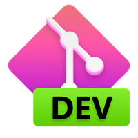

<p align="center">
  
  
  
  
</p>
<h1 align="center">
  FluentHub
</h1>
<p align="center">
  A stylish yet wonderfully powerful GitHub client
</p>

<p align="center">
  <a title="Azure Pipeline" target="_blank" href="https://dev.azure.com/fluenthub/FluentHub">
    
  </a>
  <a title="Crowdin" target="_blank" href="https://crowdin.com/project/fluenthub">
    
  </a>
  <a title="GitHub Releases" target="_blank" href="https://github.com/fluenthub-community/FluentHub/releases">
    
  </a>
  <a title="Discord" target="_blank" href="https://discord.gg/8KtRkjq2Q4">
    
  </a>
  <a title="Platform" target="_blank">
    
  </a>
</p>

---

## Installation

### Via Microsoft Store

This is our preferred method. This allows you to always be on the latest version when we release new builds with automatic updates.


### Via GitHub

Released builds can be manually downloaded from this repository's Releases page.

Download the `FluentHub_<versionNumber>.msixbundle` file from the `Assets` section. In order too install the app, you can simply double-click on the .msixbundle file, and the app installer should automatically run. If that fails for any reason, you can try the following command at a PowerShell prompt:

```powershell
# NOTE: If you are using PowerShell 7+, please run
# Import-Module Appx -UseWindowsPowerShell
# before using Add-AppxPackage.

Add-AppxPackage FluentHub_<versionNumber>.msixbundle
```

### Building from source

This allows you to use the latest commits from the main branch. The release packages doesn't exist.

Loot at the document and build it.

## Screenshots

*May not always be up-to-date due to massive changes to the user interface*


## Feedback

- [Request a new feature](https://github.com/FluentHub/FluentHub/pulls)
- Upvote popular feature requests
- [File an issue](https://github.com/FluentHub/FluentHub/issues/new/choose)
- Join [our Discord](https://discord.gg/8KtRkjq2Q4) and let us know what you think

## Contributing

There are many ways where you participate in this community:

- [Submit bugs and feature requests](https://github.com/FluentHub/FluentHub/issues/new/choose).
- Review the documentation and make pull requests for anything from typos to additional and new idea
- Review source code changes

If you are interested in fixing issues and contributing directly to the code base, please see the document [How to Contribute](docs/), which covers the following:

- [How to build and run from source](docs/)
- The development workflow, including debugging and running tests
- Coding guidelines
- [Submitting pull requests](https://github.com/FluentHub/FluentHub/pulls)
- [Finding an issue to work on](https://github.com/FluentHub/FluentHub/issues/new/choose)
- [Contributing to translations on Crowdin](https://crowdin.com/project/fluenthub)

## Contuct Us

- onein528@outlook.com
- [Our Discord channel](https://discord.gg/8KtRkjq2Q4)

## License

Copyright (c) 2022 FluentHub Team

Licensed under the MIT license stated in [LICENSE](LICENSE).
